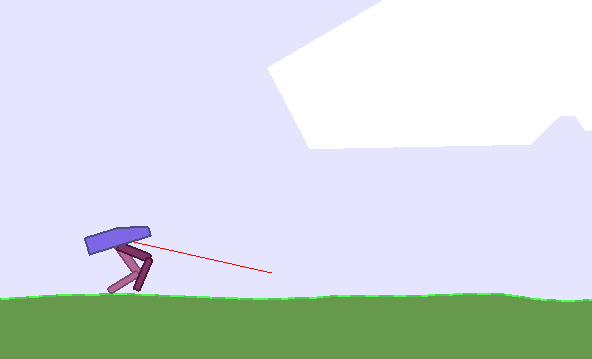

# TD3-Pytorch

### Introduction

This project is a Pytorch implentation of TD3. The paper can be found here [Addressing Function Approximation Error in Actor-Critic Methods](https://arxiv.org/abs/1802.09477).

The implementations for each environment is written in corresponding named jupyter notebook.

### Environments

#### Bipedal Walker

In this environment, reward is given for moving forward, total 300+ points up to the far end. If the robot falls, it gets -100. Applying motor torque costs a small amount of points, more optimal agent will get better score. State consists of hull angle speed, angular velocity, horizontal speed, vertical speed, position of joints and joints angular speed, legs contact with ground, and 10 lidar rangefinder measurements. There's no coordinates in the state vector.

(description from [offical documentation](https://gym.openai.com/envs/BipedalWalker-v2/))

The observation space consists of 24 variables. Each action is a vector with four numbers. Every entry in the action vector should be a number between -1 and 1.

### Dependencies

In this project, I use the following libraries.

- `Python 3.6`
- `Pytorch - 0.4.0`
- `gym - 0.11`
- `Numpy`
- `Pandas`
- `Matplotlib`
- `Jupyter notebook`

You can follow this [instruction](https://github.com/openai/gym#installation) to install OpenAI gym. Notice that Bipedal belongs to [Box2d](https://gym.openai.com/envs/#box2d) class, so only perform minimal installation is not enough, Box2d is also needed.

### Usage

Go to the project folder, and open it with jupyter notebook.

### Reference

The [code](https://github.com/sfujim/TD3) implemented by the author of the paper is really good, I reference some part from it.